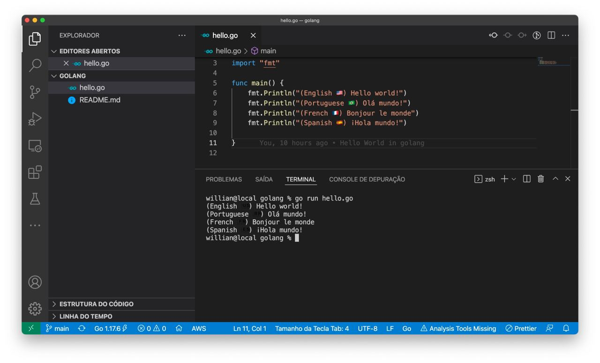

# golang Hello World

## My goal with this project is to learn about go lang environment:
* How easy is to find installer?
* How easy is to setup the environment?
* How easy is to find documentation?
* How easy is to do a "Hello World" app?
* And finnaly, how do I feel programming on this environment?

